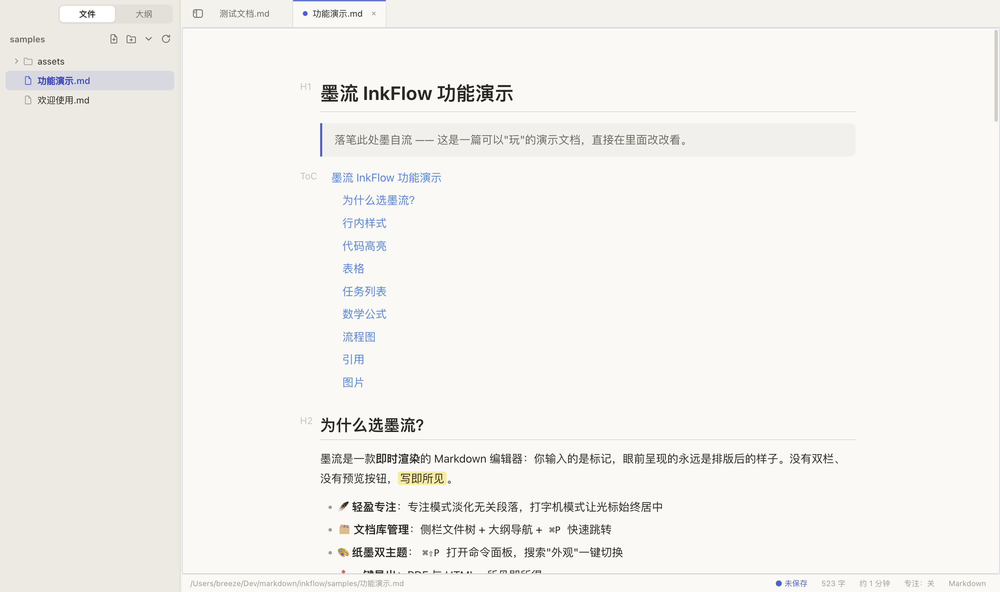
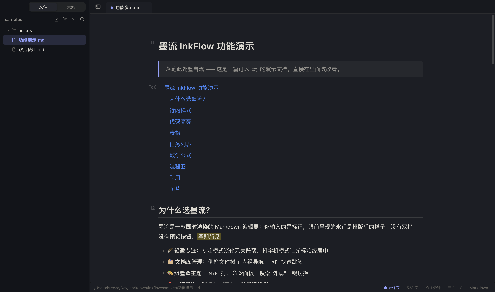

<div align="center">


为写作而生的 Markdown 编辑器 —— Typora 式即时渲染 × 现代工作流

macOS · Windows · Linux · Electron 43 · Vditor IR · MIT License

</div>

---

## 界面预览

| 纸 · 浅色 | 墨 · 深色 |
| --- | --- |
|  |  |

## 为什么是墨流

Typora 把即时渲染做到了极致，但文件管理、标签页、命令面板一直是短板。墨流在同样「写即所见」的内核之上，补齐整套现代写作工作流：

- **即时渲染**：基于 Vditor IR 模式，Markdown 标记输入即刻排版，无预览切换、无双栏
- **编辑器实例池**：每个标签页持有独立编辑器实例，切换**零重渲染**——光标、滚动位置、撤销历史原样保留
- **页签可排序**：拖拽页签，或用 `Alt+Shift+←/→` 精确调整顺序；重启后保持
- **查找与替换**：`⌘F` 查找，`⌥⌘F` 展开替换；支持区分大小写、上一处/下一处、替换当前/全部
- **块级格式快捷键**：`⌘1`~`⌘6` 秒切标题、`⌘0` 恢复正文，与 Typora 肌肉记忆一致
- **专注 & 打字机**：`⇧⌘F` 淡化非当前段落；`⇧⌘T` 光标行始终居中

## 文档库，就该像 VSCode 一样顺手

- **文件夹即文档库**：无账号、无云锁定，你的文件永远是你的
- **文件树选中态**：点选哪个目录，新建就落在哪个目录；打开文稿时自动展开路径并标记当前文件
- **无感同步**：文件系统级监听，外部增删改自动上树，不用手动刷新
- **大纲视图**：实时解析标题、联动滚动位置，点击即跳转
- **快速打开**：`⌘P` 模糊搜索库内全部文档，`⌘⇧P` 命令面板触达一切功能

## 图片，零负担

- 粘贴截图、拖入图片 → 自动保存到文档旁 `assets/`，插入**相对路径**——与 Git、静态站完全兼容
- 文件树里点图片直接打开预览页签；拖入 `.md` 文件直接打开
- 相对路径图片在编辑器内正常预览（内置本地资源服务）

## 导出，一次到位

| 格式 | 说明 |
| --- | --- |
| **PDF** | A4 排版，打印级样式；Mermaid 流程图渲染为真图，不是代码 |
| **Word (.docx)** | 图片自动内联，表格不断行 |
| **PNG 长图** | 2x 高清（1640px 宽），全文一图到底 |
| **HTML** | 自包含单文件，内联样式与字体 |

## 纸墨美学

「纸」是暖白宣纸（#faf9f5），「墨」是深青松烟（#1b1e24）——不是换皮，是两种材质。编辑区、侧栏、浮层、导出样式从同一套 CSS 变量令牌派生，支持跟随系统自动切换。页面宽度可选「正常 / 超宽」，滚动条永远贴在窗口右缘。

## 可靠，是底线

- 输入停顿 0.9s 自动落盘，**原子写入**防半截文件
- 未保存更改在关标签、退出时逐层确认
- 异常退出自动恢复未命名与未落盘内容；成功保存或明确放弃后自动清理恢复草稿
- 外部程序改动同一文稿时三方比对；冲突时暂停自动保存，由你选择载入、另存或明确覆盖
- 重启自动恢复文档库、页签顺序、侧栏宽度与界面状态
- **44 项自动化功能回归**：编辑、自动保存、单文件图片权限、富内容安全导出、树交互、格式快捷键全部有断言

## 格式支持

标题（⌘1-6）、表格、任务列表、代码高亮、KaTeX 数学公式、Mermaid 流程图/时序图、ECharts 图表、脚注、高亮标记、上下标、`[toc]` 目录、emoji 提示（输入 `:`）。

## 快捷键

> 下表为 macOS 符号；Windows / Linux 上 `⌘`→`Ctrl`、`⌥`→`Alt`、`⇧`→`Shift`，应用内提示会按平台自动显示。

| 功能 | 快捷键 | 功能 | 快捷键 |
| --- | --- | --- | --- |
| 标题 1~6 级 | `⌘1`~`⌘6` | 正文（取消标题） | `⌘0` |
| 引用 / 无序 / 有序 / 任务 | `⌥⌘Q` `⌥⌘U` `⌥⌘O` `⌥⌘X` | 切换 / 排序页签 | `⌥1`~`⌥9` / `⌥⇧←` `⌥⇧→` |
| 加粗 / 斜体 / 行内代码 / 删除线 | `⌘B` `⌘I` `⌘E` `⇧⌘X` | 专注 / 打字机 | `⇧⌘F` `⇧⌘T` |
| 新建 / 打开 / 保存 | `⌘N` `⌘O` `⌘S` | 快速打开 / 命令面板 | `⌘P` `⇧⌘P` |
| 查找 / 替换 | `⌘F` `⌥⌘F` | 查找上一处 / 下一处 | `⇧⌘G` `⌘G` |
| 打开文件夹 | `⇧⌘O` | 侧边栏 / 大纲 | `⇧⌘L` `⇧⌘J` |
| 插入链接 / 图片 / 表格 / 代码块 | `⌘K` `⌥⌘I` `⌥⌘T` `⌥⌘C` | 页面宽度 / 缩放字号 | 右键菜单 `⌘=` `⌘-` |
| 导出 PDF / Word | `⌥⌘P` `⌥⌘W` | 全部快捷键 | `⌘/` |

## 下载与安装

官网（含下载入口）：**[inkflow.yufeng.fun](https://inkflow.yufeng.fun)**

当前发布 **v1.0.6**，提供 **macOS (Apple Silicon)** 安装包。从 [Releases](https://github.com/breeze-lyf/InkFlow/releases) 下载 `InkFlow 墨流-x.y.z-arm64.dmg`，拖入「应用程序」即可。Windows / Linux 已纳入持续构建，但尚不等同于对应实体机器上的发布验收。

首次启动自动在文档目录创建「墨流示例」库，30 秒看完全部能力。

> 当前为个人构建、未公证：**macOS** 如提示"已损坏"，双击 DMG 内的「解除打开限制.command」一键解除（或终端执行 `xattr -dr com.apple.quarantine "/Applications/InkFlow 墨流.app"`）。
> 设为 Markdown 默认打开：选中任意 .md 文件 → 右键 → 显示简介 → 打开方式 → InkFlow 墨流 → 全部更改。

## 从源码构建

```bash
git clone git@github.com:breeze-lyf/InkFlow.git
cd InkFlow
npm ci
npm start            # 开发模式
npm test             # 单元测试 + JavaScript 语法扫描
npm run verify       # 再加版本一致性 + 源码功能冒烟
npm run dist         # 打包 macOS (DMG + ZIP)
npm run dist:win     # 打包 Windows (NSIS 安装包 + ZIP)
npm run dist:linux   # 打包 Linux (AppImage + ZIP)
npm run dist:all     # 一次打包三平台
```

> GitHub Actions 会在 macOS、Windows、Linux 各自完成依赖安装、单元测试、语法扫描和本平台 unpacked 构建；macOS 额外执行源码功能冒烟。构建成功不替代 Windows / Linux 实体机器验收。

## 测试

```bash
npm test                 # 单元测试 + 全仓 JavaScript 语法扫描
npm run test:smoke       # 源码功能冒烟，必须得到 44/44
npm run test:packaged    # 自动定位 dist/ 下当前平台应用并复跑 44 项
npm run version:check    # package / README / HANDOFF / 官网版本一致性
npm run artifacts:check  # DMG / ZIP 结构与版本检查
npm run verify           # test + version:check + test:smoke
```

功能冒烟运行器会为每次执行创建独立的临时 user-data，清除 `NODE_OPTIONS` / `ELECTRON_RUN_AS_NODE`，并在结束后删除临时目录。它会同时检查退出码和 `44/44 passed` 汇总，避免 Electron 提前退出被误判为成功。

## 项目结构

```
inkflow/
├── main/          # Electron 主进程：窗口/菜单/IPC/资源服务/导出/fs 监听
├── renderer/      # 界面层：HTML + CSS 变量设计系统 + Vanilla JS
│   └── js/        # app(标签/命令) editor(实例池) panels(树/大纲) overlay exporter
├── samples/       # 内置示例文档（首启复制到系统文档目录/墨流示例）
├── assets/        # 品牌资产（水墨标/横标/图标）与截图
├── scripts/       # 测试、版本、发布检查与品牌资产脚本
├── tests/         # 可脱离 Electron UI 运行的单元测试
├── docs/          # 官网镜像与维护文档
└── .github/       # 三平台持续集成
```

维护入口： [架构概览](docs/architecture/overview.md) · [数据安全](docs/data-safety.md) · [依赖升级政策](docs/dependency-policy.md) · [发布清单](docs/release-checklist.md)。统一领域词汇见 [CONTEXT.md](CONTEXT.md)。

## 致谢与技术栈

- [Vditor](https://github.com/Vanessa219/vditor)（MIT）— 即时渲染 Markdown 内核（Lute / KaTeX / Mermaid / highlight.js / ECharts）
- [Electron](https://github.com/electron/electron)（MIT）— 桌面应用框架
- [html-to-docx](https://github.com/privateOmega/html-to-docx)（MIT）— Word 导出

第三方许可详见 [THIRD-PARTY-LICENSES.md](THIRD-PARTY-LICENSES.md)。

---

<div align="center">
InkFlow 墨流 · [MIT License](LICENSE)
</div>
