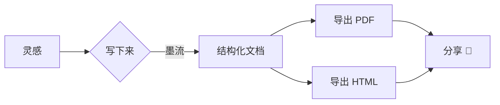

> 这是一篇可以"玩"的演示文档 —— 直接在里面改改看。

[toc]

## 为什么选墨流？

墨流是一款**即时渲染**的 Markdown 编辑器：你输入的是标记，眼前呈现的永远是排版后的样子。没有双栏、没有预览按钮，==写即所见==。

- 🪶 **轻盈专注**：专注模式淡化无关段落，打字机模式让光标始终居中
- 🗂 **文档库管理**：侧栏文件树 + 大纲导航 + `⌘P` 快速跳转
- 🎨 **纸墨双主题**：`⌘⇧P` 打开命令面板，搜索"外观"一键切换
- 📤 **一键导出**：PDF 与 HTML，所见即所得
- 🖼 **图片零负担**：截图粘贴、拖入图片，自动存入 `assets/` 并插入相对路径

## 行内样式

支持 **加粗**、*斜体*、~~删除线~~、`行内代码`、==高亮标记==，以及 [链接](https://github.com) 和脚注[^1]。

[^1]: 这是一个脚注示例，点击可跳转。
    
中英文混排时会自动留出舒适的间距，H₂O 与 E=mc² 这样的上下标也不在话下。

## 代码高亮

```javascript
// 墨流启动！
const inkflow = await createEditor({
  mode: 'ir',            // 即时渲染
  theme: 'paper',        // 纸主题
  typewriter: true,      // 打字机模式
});

inkflow.on('input', (doc) => {
  autosave(doc, { debounce: 900 });
});
```

```python
def quick_open(library, query):
    """模糊匹配库内文档"""
    return sorted(library, key=lambda f: fuzzy_score(query, f.name), reverse=True)
```

## 表格


| 功能     | 快捷键 |             说明 |
| :------- | :-----: | ---------------: |
| 新建文件 |  `⌘N`  | 创建未命名标签页 |
| 快速打开 |  `⌘P`  | 模糊搜索库内文档 |
| 命令面板 | `⇧⌘P` | 所有命令触手可及 |
| 专注模式 | `⇧⌘F` |   只高亮当前段落 |
| 导出 PDF | `⌥⌘P` |      A4 排版输出 |

## 任务列表

- [X]  即时渲染内核
- [X]  文档库与大纲
- [X]  明暗双主题
- [X]  图片自动落盘
- [ ]  你来试试专注模式（`⇧⌘F`）

## 数学公式

行内公式：质能方程 $E = mc^2$，以及欧拉恒等式 $e^{i\pi} + 1 = 0$。

块级公式：

$$
\int_{-\infty}^{+\infty} e^{-x^2} \, dx = \sqrt{\pi}
$$

## 流程图



## 引用

> 纸上得来终觉浅，绝知此事要躬行。
>
> —— 陆游《冬夜读书示子聿》

## 图片

把图片拖进窗口，或直接 `⌘V` 粘贴截图，墨流会自动把图片保存到文档旁的 `assets/` 文件夹并插入相对路径 —— 就像下面这张（它引用的是应用自带的图标文件）：


---

*试试按 `⇧⌘F` 进入专注模式，再上下移动光标 —— 只有当前段落会保持清晰。*
